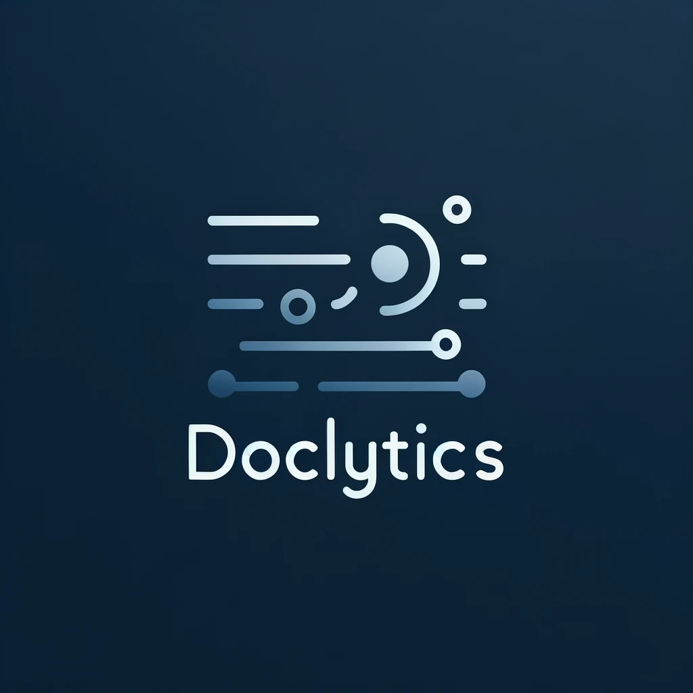

# Doclytics


## Description

Doclytics is a straightforward Rust-based tool that integrates with the paperless-ngx API to fetch and update document metadata. It primarily leverages a local language model, ollama, to extract and generate metadata for documents stored in a Paperless document library. The tool uses `reqwest` for making HTTP requests and `serde_json` for handling JSON data, ensuring seamless communication with the Paperless API and efficient data processing.

By interfacing directly with ollama, Doclytics automates the extraction of specified metadata from documents, utilizing the local LLM's capabilities to analyze document content and produce the required metadata in a JSON format. This metadata is then used to update the respective documents in the Paperless library, aiming to improve document organization and retrievability without overly complex processes or configurations.

## Prerequisites

Before setting up and running Doclytics, ensure you have the following prerequisites installed and configured:

1. **Rust Environment:** Doclyics is built with Rust, so you need to have Rust installed on your machine. If you haven't already installed Rust, follow the instructions on the [official Rust website](https://www.rust-lang.org/tools/install).

2. **Paperless-ngx Instance:** You should have a running instance of Paperless-ngx, as Doclytics interacts with its API. Ensure that your Paperless-ngx instance is accessible and that you have the necessary permissions to interact with it.
   1. Create a custom field called `tagged` of type `Boolean` in custom fields. Furthermore, create an arbitrary number of fields, you want Doclytics to extract metadata for.
   2. Get Your API-Token from clicking on "Your Username" -> My Profile -> API Auth Token

3. **Ollama Setup:**
   - **Ollama Installation:** Ensure that you have ollama installed and properly configured in your environment. Follow the installation instructions provided in the [ollama repository](https://github.com/ollama/ollama) to set up ollama on your system.
   - **Starting Ollama:** Once installed, you need to start the ollama service using the command `ollama serve`. This command initializes the ollama server, allowing Doclytics to communicate with it for processing documents.
   - **Model Selection:**
     - For processing documents with ollama, the `llama2-7b` model can be used, but it may have difficulties returning outputs as plain JSON. 
     - Alternatively, the `llama2-13b` parameter model is known to work reasonably well with Doclytics, offering a good balance between performance and output quality. It's essential to choose a model that aligns with your requirements for metadata extraction accuracy and format.

4. **Docker (Optional):** If you prefer to run Doclytics within a Docker container, ensure Docker is installed and running on your machine. This approach is beneficial for maintaining a consistent environment and simplifying deployment.

5. **Git:** To clone the Doclytics repository, you'll need Git installed on your machine. Git will allow you to obtain the latest version of the project and stay updated with any changes.

With these prerequisites met, you are now ready to proceed with the installation and configuration of Doclytics to enhance your document management workflow with advanced metadata extraction capabilities.
## Setup

1. **Install Rust:** Follow the installation guide on the [official Rust website](https://www.rust-lang.org/tools/install) to set up Rust on your system.

2. **Clone the Repository:** Use the command `git clone https://github.com/B-Urb/doclytics.git` to clone the project repository.

3. **Navigate to the Project Directory:** Change into the project's directory with `cd doclytics`.

4. **Build the Project:** Compile the project using `cargo build`.

5. **Run the Project:** Start the application with `cargo run`.

## Environment Variables

The application requires setting environment variables for its configuration. Below is a table describing each environment variable, indicating whether it is required or optional, its default value (if any), and a brief description:

| Environment Variable     | Required | Default Value                                | Description                                                                                                                     |
|--------------------------|---------|----------------------------------------------|---------------------------------------------------------------------------------------------------------------------------------|
| `PAPERLESS_TOKEN`        | Yes     | None                                         | The authentication token for accessing the Paperless API.                                                                       |
| `PAPERLESS_BASE_URL`     | Yes     | None                                         | The base URL for the Paperless API.                                                                                             |
| `PAPERLESS_FILTER`       | NO      | "NOT tagged=true"                            | Filter string that filters the documents to be fetched from paperless                                                           |
| `OLLAMA_HOST`            | No      | "localhost"                                  | The hostname where the Ollama service is running.                                                                               |
| `OLLAMA_PORT`            | No      | "11434"                                      | The port on which the Ollama service is accessible.                                                                             |
| `OLLAMA_SECURE_ENDPOINT` | No      | "false"                                      | Whether to use HTTPS (`true`) or HTTP (`false`) for Ollama.                                                                     |
| `OLLAMA_MODEL`           | No      | "llama2:13b"                                 | The specific Ollama model to be used for processing.                                                                            |
| `BASE_PROMPT`            | No      | see [Example Prompt](example/example.prompt) | Prompt given to the model, for requesting metadata.<br/> Should contain the custom fields in paperless that you want doclytics. |
| `LOG_LEVEL`              | No      | INFO                                         | Log level                                                                                                                       |


Make sure to set the required environment variables (`PAPERLESS_TOKEN` and `PAPERLESS_BASE_URL`) before running the application. Optional variables have default values and will use those defaults if not explicitly set.
For Development these should be defined in a `.env` file located at the root of your project directory.

## Docker Integration

To facilitate easier deployment and environment management, Doclytics provides a Docker container setup.

### Docker Image

The Docker image for Doclytics can be found on Docker Hub: `bjoern5urban/doclytics:latest`.

### Docker Compose

Here's an example `docker-compose.yml` snippet for setting up Doclytics:

```yaml
version: '3'
services:
  doclytics:
    image: bjoern5urban/doclytics:v1.0.0
    environment:
      PAPERLESS_BASE_URL: http://your-paperless-instance
      PAPERLESS_TOKEN: yourapitoken
    volumes:
      - ./data:/app/data
```

This configuration mounts a local directory (`./data`) to the `/app/data` directory inside the container, allowing persistent data storage.

### Docker Run

Alternatively, you can use `docker run` to start the container:

```bash
docker run --network="host" -e PAPERLESS_BASE_URL=http://your-paperless-instance -e PAPERLESS_TOKEN=yourapitoken bjoern5urban/doclytics:v1.0.0
```
Ensure to replace `http://your-paperless-instance` and `yourapitoken` with your actual Paperless instance URL and API token.
> [!IMPORTANT]
> When using `ollama serve` on the host system, please ensure you set the `OLLAMA_HOST` environment variable to `host.docker.internal`. This setting is crucial for proper communication between your containerized application and the Ollama service running on the host.


## Usage

Doclytics uses the custom field `tagged` to query documents not yet analyzed from your paperless instance. 
You can pass a prompt like this [Example Prompt](example/example.prompt) to generate metadata. Json is automatically extracted
from the LLM's answer, however it is recommended to explicitly specify that you want json returned, especially for smaller
models or else you might not get any parseable json back at all. 

If you want to explicitly reanalyze a specific document, the easiest way would be to set the `tagged` custom field to 
false in the UI.


## Contributing

Contributions are encouraged! If you're interested in enhancing Doclytics, please fork the repository, create a feature branch, and submit a pull request. For substantial changes or enhancements, opening an issue for discussion is recommended.

## License

Doclytics is released under the [MIT License](https://choosealicense.com/licenses/mit/).